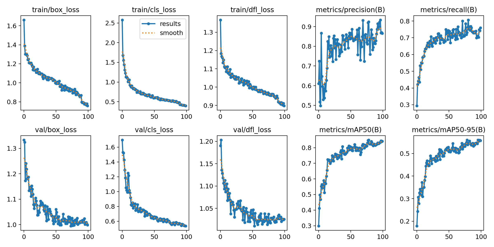
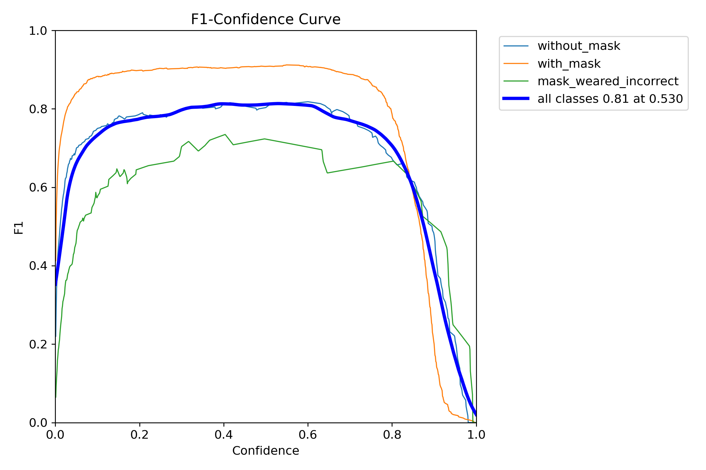
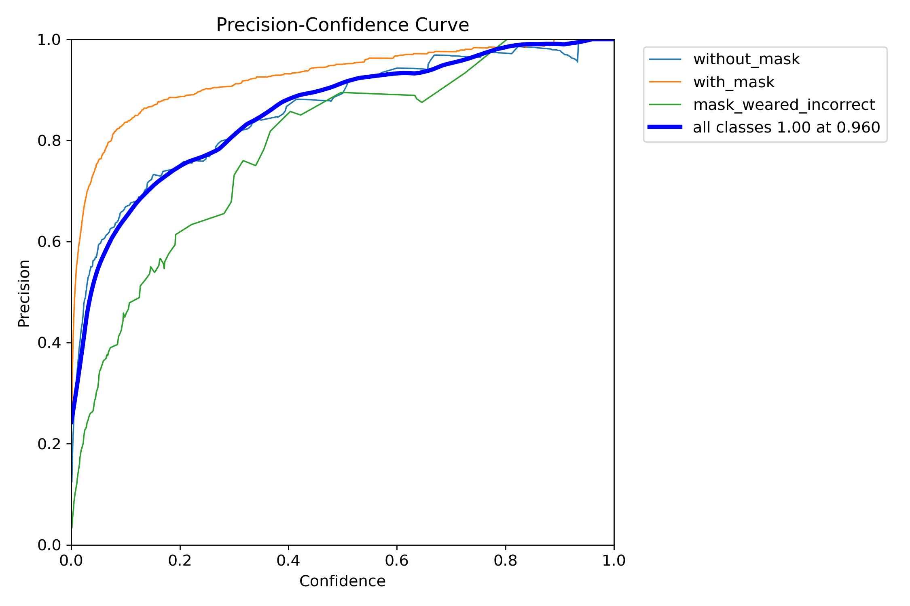
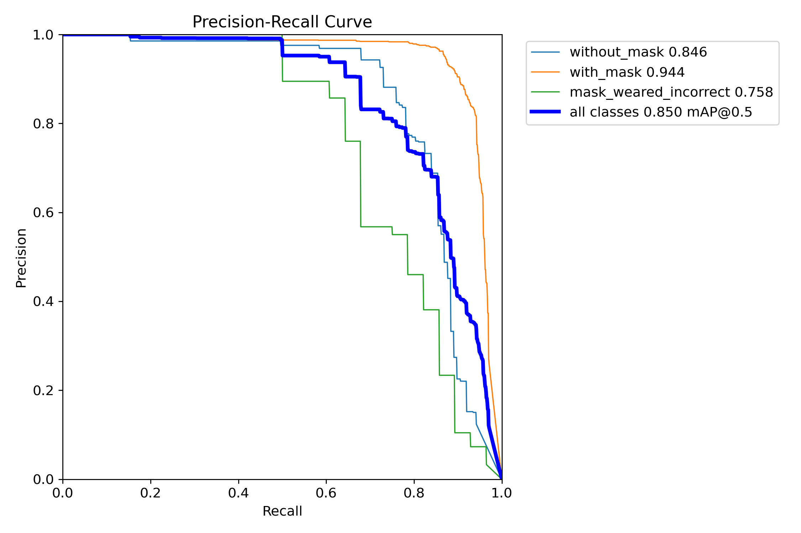
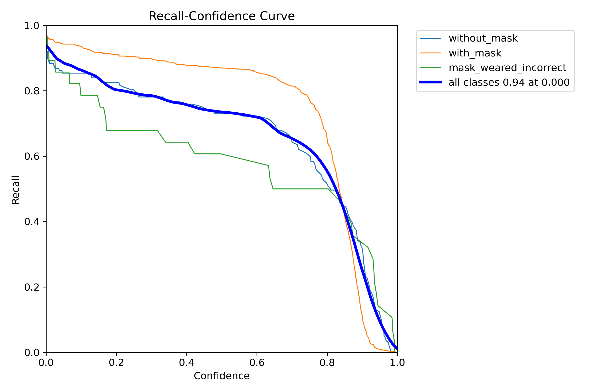
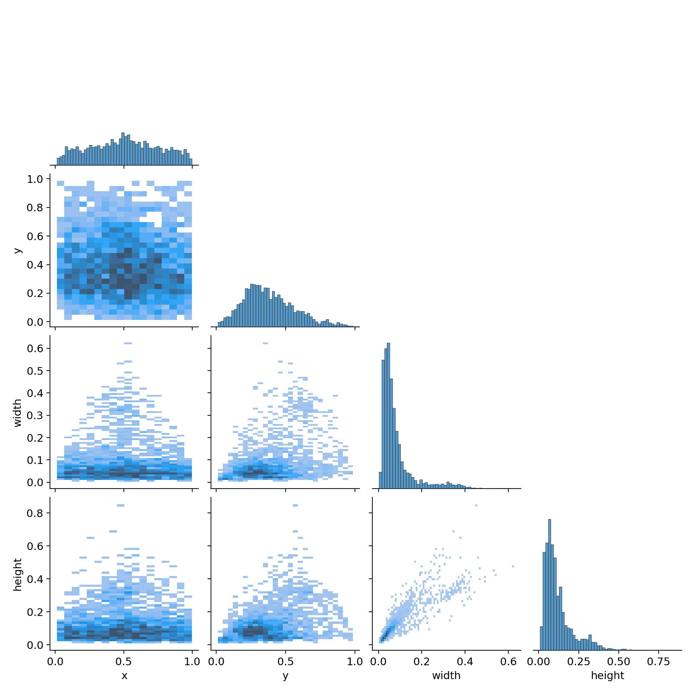
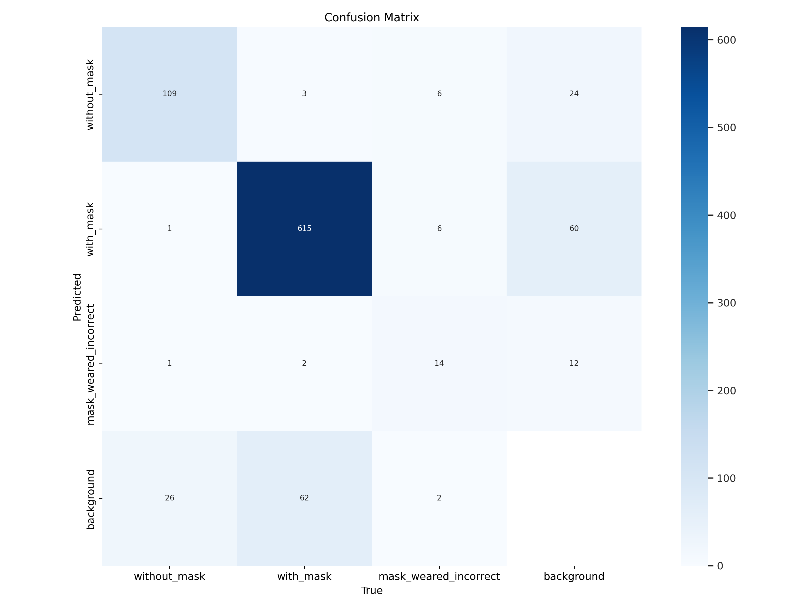
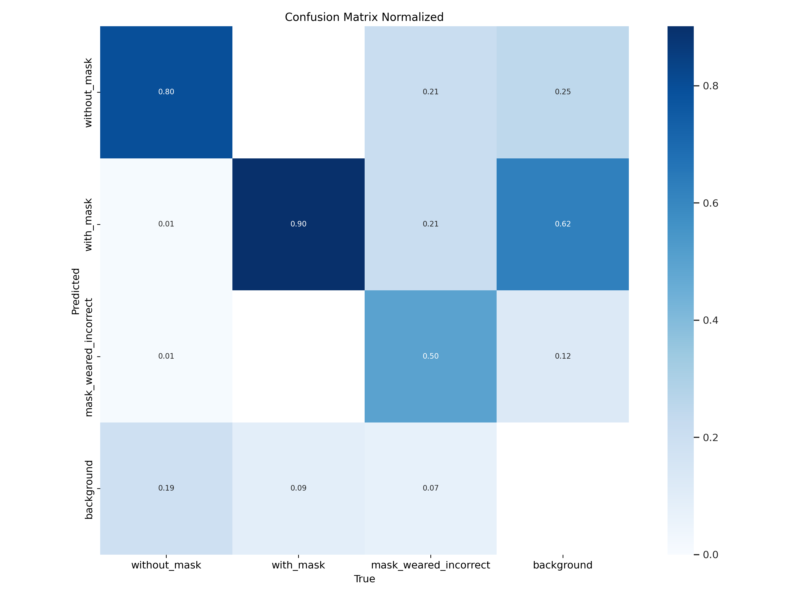

## Mask Detection

### Overview
This documentation provides information about the Mask Detection project, including the data used, the methods and ideas employed, and the metrics achieved. It also includes usage instructions and author information.


### Data
The dataset used for training and scoring is loaded with pytorch and consists images of people with mask, without mask and incorrect worn mask.

[Link to the dataset on Kaggle](https://www.kaggle.com/datasets/andrewmvd/face-mask-detection)
## Model Architecture
The Mask detection neural network model is built using the [YOLOv8](https://github.com/ultralytics/ultralytics)
## Metrics
#### Results:

#### F1:

#### Precision-Confidence:

#### Precision-Recall:

#### Recall-Confidence:

#### Labels Correlogram:

#### Confusion matrix:

#### Normalized confusion matrix:

## Usage
### Requirements

- Python 3.10

### Getting Started
Clone repository
```bash
git clone https://github.com/SoulHb/Mask Detection.git
```
Move to project folder
```bash
cd Mask Detection
```
Install dependencies
```bash
pip install -r requirements.txt
```
### Training
The model is trained on the provided dataset using the following configuration:
- Optimizer: Adam
- Learning rate: 0.001
- Batch size: 2
- Number of epochs: 100
- Image size: (640, 640)

Move to src folder
```bash
cd src
```
Run train.py
```bash
python train.py --image_height 256 --image_width 256 --data_path /path/to/data --epochs 10 --lr 0.001 --batch_size 32 --model_name my_model
```

## Inference
To use the trained model for Mask Detection, follow the instructions below:
### Without docker:
Move to src folder
```bash
cd src
```
Run Flask api
```bash
python inference.py --saved_model_path /path/to/your/saved/model
```

Run streamlit ui
```bash
python ui.py
```

Open streamlit ui in browser
```bash
streamlit run ui.py
```
### With docker:
Move to src folder
```bash
cd Mask Detection
```
Run docker-compose
 ```bash
docker-compose -f docker_compose.yml up
```

## Author
This Mask Detection project was developed by Namchuk Maksym. If you have any questions, please contact me: namchuk.maksym@gmail.com
